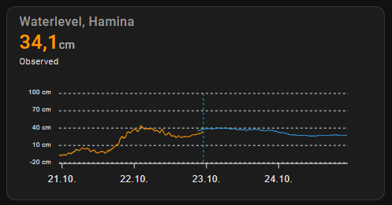

# FMI waterlevels for Home Assistant

## What is it?

A custom component that integrates with Finnish Meteorological Institute to waterlevel observations and forecasts.

## Installation

### Manual

1. Download source code from latest release tag
2. Copy custom_components/fmi_waterlevel folder to your Home Assistant installation's config/custom_components folder.
3. Restart Home Assistant
4. Configure the integration by adding a new integration in settings/integrations page of Home Assistant

### Integration settings

| Name           | Type    | Requirement  | Description                                     | Default |
|----------------|---------| ------------ |-------------------------------------------------|---------|
| location       | string  | **Required** | Target location from a predefined list          | Föglö   |
| hours          | int     | **Required** | Number of hours of observations to retrieve     | 48      |
| forecast_hours | int     | **Required** | Number of hours of forecasts to retrieve        | 48      |
| step           | int     | **Required** | Time step between two values in minutes         | 15      |
| overlap        | int     | **Required** | Overlap of forecast and observations in minutes | 120     |

### State attributes

This integration returns the latest waterlevel as the sensor state. It also returns the following state attributes.

| Name              | Type                              | Description                                                                      |
|-------------------|-----------------------------------|----------------------------------------------------------------------------------|
| latest_waterlevel | float                             | Latest waterlevel for selected location of the sensor                            |
| latest_date       | date                              | Date of the latest waterlevel                                                    |
| location          | string                            | Source location of the data                                                      |
| observations      | [{date: date, waterlevel: float}] | An array of observed waterlevel values for the selected location of the sensor   |
| forecast          | [{date: date, waterlevel: float}] | An array of forecasted waterlevel values for the selected location of the sensor |

### Usage with apexcharts-card

One use case for this integration could be to show waterlevel values with [apexcharts-card](https://github.com/RomRider/apexcharts-card).

Below is an example configuration for showing waterlevels (2 days of observations and 2 days of forecasts, 2 hour overlap).



```
type: custom:apexcharts-card
graph_span: 4d
span:
  offset: +2d
now:
  show: true
header:
  show: true
  title: Waterlevel, Hamina
  show_states: true
  colorize_states: true
all_series_config:
  curve: straight
apex_config:
  chart:
    height: 150px
  legend:
    show: false
  xaxis:
    labels:
      format: dd.MM.
series:
  - entity: sensor.fmi_waterlevel_134254_48_48
    data_generator: |
      return entity.attributes.observations.map((entry) => {
        return [entry["date"], entry["waterlevel"]];
      });
    stroke_width: 1
    float_precision: 3
    yaxis_id: observations
    name: Observed
  - entity: sensor.fmi_waterlevel_134254_48_48
    data_generator: |
      return entity.attributes.forecast.map((entry) => {
        return [entry["date"], entry["waterlevel"]];
      });
    stroke_width: 1
    float_precision: 3
    yaxis_id: observations
    show:
      in_header: false
yaxis:
  - id: observations
    min: ~-20
    max: ~100
    apex_config:
      tickAmount: 4
      labels:
        style:
          fontSize: 8px
        formatter: |
          EVAL:function(value) {
            return value.toFixed(0) + ' cm'; 
          }
  - id: forecast
    min: ~-20
    max: ~100
    apex_config:
      tickAmount: 4
      labels:
        style:
          fontSize: 8px
        formatter: |
          EVAL:function(value) {
            return value.toFixed(0) + ' cm'; 
          }
```
